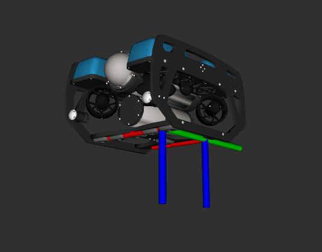
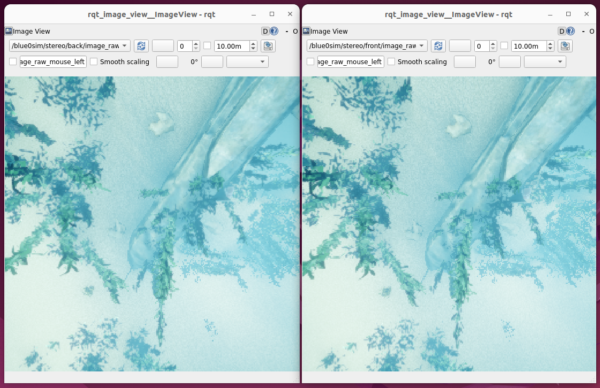
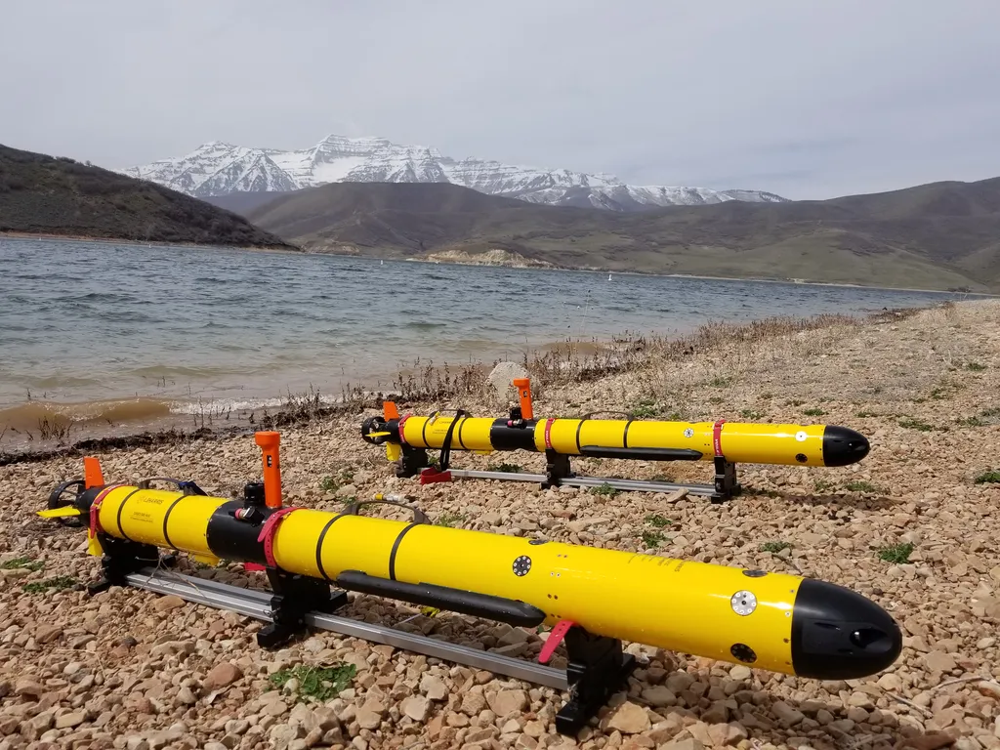
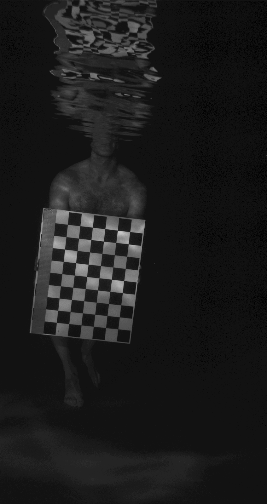
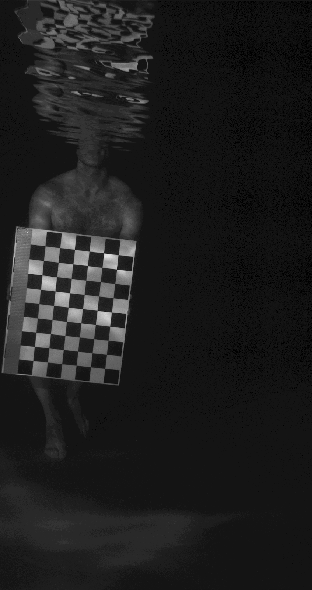
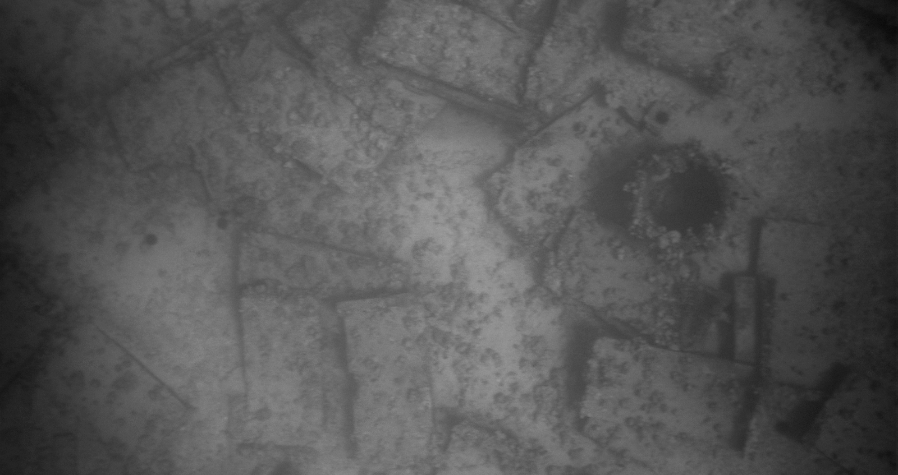
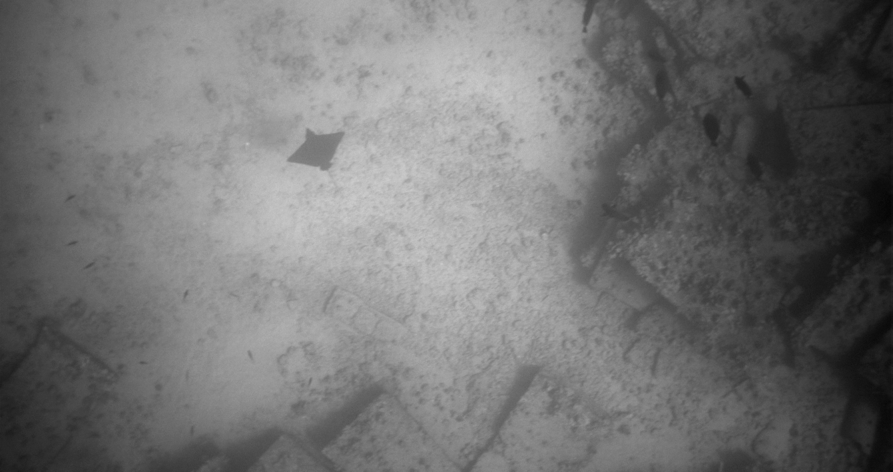

# 🌊 CoUGARs Visual DVL

[](https://github.com/cougars-auv/coug_visual_dvl/actions/workflows/ros2_build_and_test.yml)
[](https://github.com/cougars-auv/coug_visual_dvl/actions/workflows/docker_build.yml)
[](https://results.pre-commit.ci/latest/github/cougars-auv/coug_visual_dvl/main)
[](https://codecov.io/gh/cougars-auv/coug_visual_dvl)

<p align="left">
  
</p>

## Project Proposal

### Motivation

Doppler Velocity Logs (DVLs) use acoustics to provide high-accuracy linear velocity measurements relative to the seafloor. They are critical to autonomous underwater vehicle (AUV) localization systems, especially during extensive, GPS-denied underwater missions. However, DVLs are susceptible to challenging terrain such as steep dropoffs, acoustic-scattering surfaces, and marine life. When the DVL loses bottom lock and stops publishing reliable data, the localization system often relies purely on dead-reckoning from an Inertial Measurement Unit (IMU), which can quickly lead to rapid unbounded drift in positional accuracy. Developing a robust, vision-based alternative with downward-facing stereo cameras would provide critical linear velocity observability during DVL dropouts, effectively bounding navigation drift.

We acknowledge that the correct approach to this problem is a full visual odometry pipeline that provides the estimator with more information than just linear velocity measurements. However, to limit the project scope and simplify integration into existing software, we’ve opted to strictly estimate 3D linear velocity, treating our computer vision pipeline as a sort of simulated hardware sensor.

### Approach

While our final approach will ultimately be decided by future development and experimentation, we anticipate incorporating a combination of camera calibration, image preprocessing, feature tracking, optical flow, outlier rejection, and stereo depth estimation. This should allow us to track the movement of detected features in the camera images relative to the AUV, estimate their position (and velocity) in 3D space, and reject likely outliers caused by common underwater challenges such as wavelength absorption, caustics, or “marine snow.”

### Simulation Validation

To validate our approach, we plan to use the HoloOcean marine robotics simulator. HoloOcean is built around Unreal Engine 5, a video game engine known for photorealistic visuals. By comparing the BlueROV agent’s actual linear velocity against the predicted linear velocity determined from the simulated stereo images, we should be able to calculate the RMSE between our estimate and ground truth. Using HoloOcean will also allow us to benchmark the real-time performance of the approach online during simulated missions.

<br>

<p align="center">
  
</p>

<p align="center">
  <em>Fig. 1. Front and back HoloOcean stereo camera frames on the BlueROV2.</em>
</p>

<br>

<p align="center">
  
</p>

<p align="center">
  <em>Fig. 2. Example front and back HoloOcean stereo camera images displayed side-by-side.</em>
</p>

### Hawaii Dataset Validation

In addition to simulation validation, the FROST Lab has collected time-synchronized DVL and stereo camera imagery from IVER3 AUV field tests in Hawaii. We plan to use these images to estimate the AUV’s linear velocity and compare them against corresponding DVL measurements to get a RMSE metric using the same approach as in simulation. Comparing the dataset timestamps against the script processing duration will also serve as a real-time performance benchmark.

<br>

<p align="center">
  
</p>

<p align="center">
  <em>Fig. 3. IVER3 AUVs used by the BYU FROST Lab for Hawaii data collection.</em>
</p>

<br>

<p align="center">
  
  
</p>

<p align="center">
  <em>Fig. 4. Select stereo camera image pair from the calibration dataset.</em>
</p>

<br>

<p align="center">
  
</p>
<p align="center">
  
</p>

<p align="center">
  <em>Fig. 5. Select stereo camera images (not matched) from an IVER3 mission in Hawaii.</em>
</p>

## Contributing

We **strongly recommend** using the `cougars-dev` development environment. See the [Contributing](https://github.com/cougars-auv/cougars-dev/blob/main/README.md#contributing) section there.

## Releasing

We adhere to the **Semantic Versioning (SemVer 2.0.0)** standard to release new versions of this repository:
> Given a version number **`MAJOR.MINOR.PATCH`**, increment the:
> - **MAJOR** version when you make incompatible API changes
> - **MINOR** version when you add functionality in a backward compatible manner
> - **PATCH** version when you make backward compatible bug fixes

- **Tag and Push:** Create and push a version tag (e.g., `v1.2.3`) on your release commit:

  ```bash
  git tag v1.2.3
  git push origin v1.2.3
  ```

  Pushing the tag automatically opens a draft GitHub Release with auto-generated notes.

- **Publish a GitHub Release:** Review the draft release in GitHub and click **Publish**.

## Citations

Please cite our relevant publications if you find this repository useful for your research:

### CoUGARs
```bibtex
@misc{durrant2025lowcostmultiagentfleetacoustic,
  title={Low-cost Multi-agent Fleet for Acoustic Cooperative Localization Research},
  author={Nelson Durrant and Braden Meyers and Matthew McMurray and Clayton Smith and Brighton Anderson and Tristan Hodgins and Kalliyan Velasco and Joshua G. Mangelson},
  year={2025},
  eprint={2511.08822},
  archivePrefix={arXiv},
  primaryClass={cs.RO},
  url={https://arxiv.org/abs/2511.08822},
}
```
